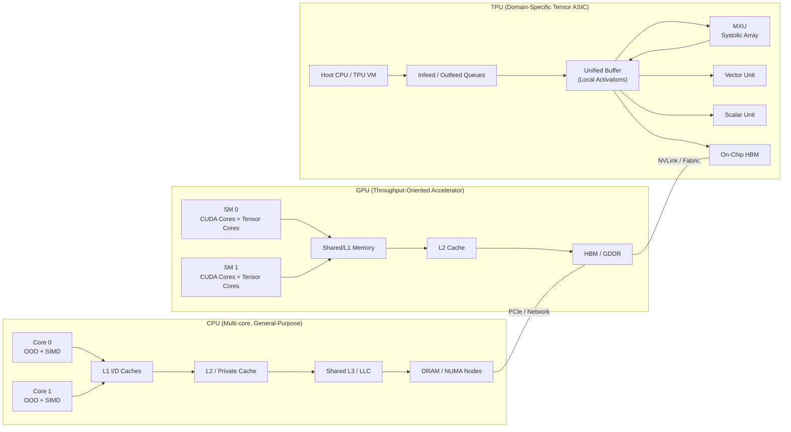

```mermaid
flowchart LR
  subgraph CPU["CPU (Multi-core, General-Purpose)"]
    CPU_Core0["Core 0\nOOO + SIMD"]
    CPU_Core1["Core 1\nOOO + SIMD"]
    CPU_L1["L1 I/D Caches"]
    CPU_L2["L2 / Private Cache"]
    CPU_L3["Shared L3 / LLC"]
    CPU_DRAM["DRAM / NUMA Nodes"]

    CPU_Core0 --> CPU_L1 --> CPU_L2
    CPU_Core1 --> CPU_L1
    CPU_L2 --> CPU_L3 --> CPU_DRAM
  end

  subgraph GPU["GPU (Throughput-Oriented Accelerator)"]
    GPU_SM0["SM 0\nCUDA Cores + Tensor Cores"]
    GPU_SM1["SM 1\nCUDA Cores + Tensor Cores"]
    GPU_L1["Shared/L1 Memory"]
    GPU_L2["L2 Cache"]
    GPU_HBM["HBM / GDDR"]

    GPU_SM0 --> GPU_L1 --> GPU_L2 --> GPU_HBM
    GPU_SM1 --> GPU_L1
  end

  subgraph TPU["TPU (Domain-Specific Tensor ASIC)"]
    TPU_Host["Host CPU / TPU VM"]
    TPU_Infeed["Infeed / Outfeed Queues"]
    TPU_UB["Unified Buffer\n(Local Activations)"]
    TPU_MXU["MXU\nSystolic Array"]
    TPU_VEC["Vector Unit"]
    TPU_SCA["Scalar Unit"]
    TPU_HBM["On-Chip HBM"]

    TPU_Host --> TPU_Infeed --> TPU_UB
    TPU_UB --> TPU_MXU --> TPU_UB
    TPU_UB --> TPU_VEC
    TPU_UB --> TPU_SCA
    TPU_UB --> TPU_HBM
  end

  CPU_DRAM ---|PCIe / Network| GPU_HBM
  GPU_HBM ---|NVLink / Fabric| TPU_HBM
```
