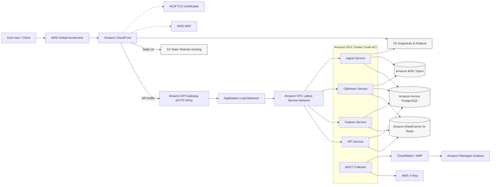

```mermaid
graph LR
  %% Edge and global routing
  user["End User / Client"] --> ga["AWS Global Accelerator"]
  ga --> cf["Amazon CloudFront"]

  cf -->|API traffic| apigw["Amazon API Gateway (HTTP APIs)"]
  cf -->|Static UI| s3ui["S3 Static Website Hosting"]

  apigw --> alb["Application Load Balancer"]
  alb --> lattice["Amazon VPC Lattice Service Network"]

  %% EKS cluster and services
  subgraph eks["Amazon EKS Cluster (multi-AZ)"]
    api["API Service"]
    feature["Feature Service"]
    optimizer["Optimizer Service"]
    ingest["Ingest Service"]
    adot["ADOT Collector"]
  end

  lattice --> api
  lattice --> feature
  lattice --> optimizer
  lattice --> ingest

  %% Data stores and streaming
  api --> redis[(Amazon ElastiCache for Redis)]
  feature --> redis
  optimizer --> redis

  api --> aurora[(Amazon Aurora PostgreSQL)]
  feature --> aurora
  optimizer --> aurora
  ingest --> aurora

  ingest --> msk[(Amazon MSK Topics)]
  optimizer --> msk

  ingest --> s3["S3 Snapshots & Artifacts"]
  cf --> s3

  %% Observability
  adot --> xray["AWS X-Ray"]
  adot --> cw["CloudWatch / AMP"]
  cw --> amg["Amazon Managed Grafana"]

  %% Security and certificates at edge (dashed)
  cf -.-> waf["AWS WAF"]
  cf -.-> acm["ACM TLS Certificates"]

  %% Styling (optional)
  classDef store fill:#f6f6f6,stroke:#333,stroke-width:1px;
  class redis,aurora,msk,s3,s3ui store;
```
